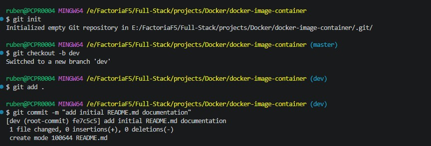
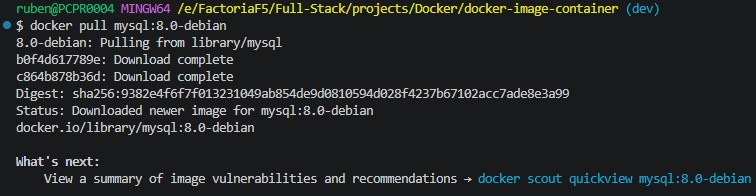

  # OBJETIVO DEL EJERCICIO
  Vamos a aprender a trabajar con imágenes y contenedores Docker, y aprender a crear y gestionar sus Bases de datos (DB)

## GIT

- Git init para inicializar Git en repositorio
- Generar repositorio en GitHub
- Generar las ramas pertinentes | `git checkout -b`
    - main: despliegue
    - dev: rama de unificación de trabajo
    - subramas: donde se van a trabajar los features

- Enlazar repositorios: `git remote add origin` <HTTPS de proyecto>
- Subir las ramas pertinentes y ponerse manos a la obra. | `git push -u origin <nombre de rama>`(para la primera vez), luego `git push origin <nombre de rama>`

## Buenas prácticas

Dentro del desarrollo del ejercicio se intentará trabajar de forma rigurosa los commit atómicos, correcta formulación de commits mediante Conventional Commits, un buen uso de branches y una correcta estructuración y versionado del proyecto.

## Primeros pasos

1- Abrir una terminal bash y obtener la imagen con la que se va a trabajar, en este caso: mysql:8.0-debian
Para esto, vamos a ejecutar el comando: `docker pull mysql:8.0-debian`

2- Generar un container utilizando la imagen que hemos importado:
    - `docker run --name nombre-proyecto -e MYSQL_ROOT_PASSWORD=contraseña -d mysql:8.0-debian`

### Explicación de comando
docker | Ejecuta el cliente de Docker
run | Crea e inicial un nuevo contenedor a partir de una imagen
--name nombre-proyecto | Asigna nombre al contenedor
-e MYSQL_ROOT_PASSWORD=contraseña | Define la variable de entorno como MYSQL_ROOT_PASSWORD y establece una contraseña del usuario root de MySQL
-d Ejecuta el contenedor en modo detached (segundo plano)
 mysql:tag | Especifica la imagen y su versión (tag) que se utilizará para crear el contenedor

Nota: Puedes apoyarte de los siguientes comandos para saber que imagenes o containers tienes:
`docker images` - imágenes
`docker ps`- contenedores