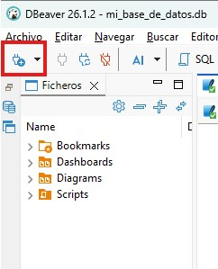
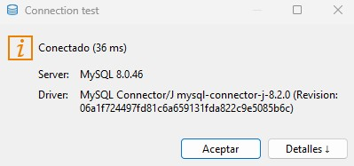
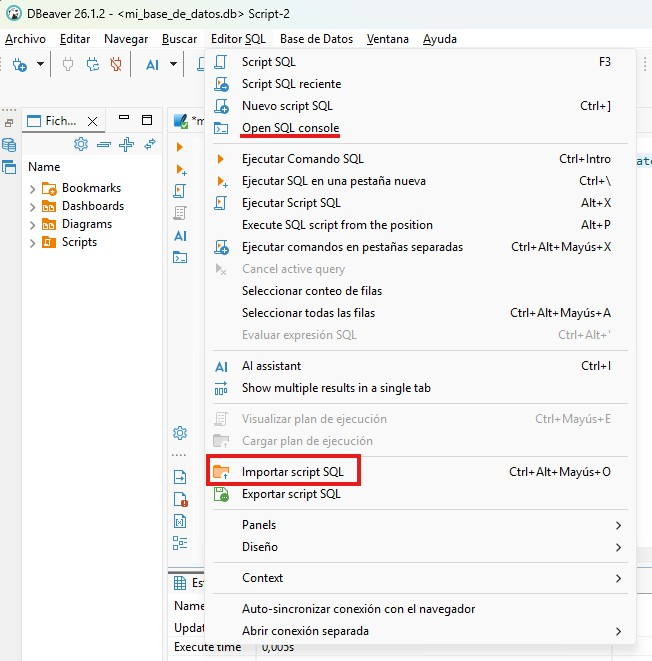

# OBJETIVO DEL EJERCICIO
Vamos a aprender a trabajar con imágenes y contenedores Docker, y aprender a crear y gestionar Bases de datos (DB)

## GIT

- `Git init` para inicializar Git en repositorio
- Generar repositorio en GitHub
- Generar las ramas pertinentes | `git checkout -b`
    - main: despliegue
    - dev: rama de unificación de trabajo
    - subramas: donde se van a trabajar los features


- Enlazar repositorios: `git remote add origin` <HTTPS de proyecto>
- Subir las ramas pertinentes y ponerse manos a la obra. | `git push -u origin <nombre de rama>`(para la primera vez), luego `git push origin <nombre de rama>`

## Buenas prácticas

Dentro del desarrollo del ejercicio se intentará trabajar de forma rigurosa los commit atómicos, correcta formulación de commits mediante Conventional Commits, un buen uso de branches y una correcta estructuración y versionado del proyecto.

## Primeros pasos

1. Abrir una terminal bash y obtener la imagen con la que se va a trabajar, en este caso: mysql:8.0-debian
Para esto, vamos a ejecutar el comando: `docker pull mysql:8.0-debian`


2. Generar un container utilizando la imagen que hemos importado:
    - `docker run --name nombre-proyecto -e MYSQL_ROOT_PASSWORD=contraseña -p 3306:3306 -d mysql:8.0-debian`

### Explicación de comando
```bash
docker | Ejecuta el cliente de Docker
run | Crea e inicia un nuevo contenedor a partir de una imagen
--name nombre-proyecto | Asigna un nombre al contenedor
-e MYSQL_ROOT_PASSWORD=contraseña | Define la variable de entorno MYSQL_ROOT_PASSWORD y establece la contraseña del usuario root de MySQL
-p 3306:3306 | Mapea el puerto 3306 del equipo anfitrión (host) al puerto 3306 del contenedor, permitiendo acceder al servidor MySQL desde el exterior del contenedor
-d | Ejecuta el contenedor en modo detached (en segundo plano)
mysql:8.0-debian | Especifica la imagen y la versión (tag) que se utilizará para crear el contenedor
```


**Nota**: Puedes apoyarte de los siguientes comandos para saber qué imágenes o contenedores tienes:
```bash
docker images - imágenes
docker ps - contenedores
```

## Preparación Dbeaver

1. Abrimos Dbeaver, y clickamos en crear Base de datos


2. Seleccionamos MySQL como indica el ejercicio y le damos a siguiente.

3. Ahora vamos a configurar en la pestaña General:
- Dejar Database vacio
- nombre de usuario y contraseña deben coincidir con los datos introducidos en el container docker que hemos arrancado anteriormente.
- En la pestaña Driver Properties:
    - allowPublicKeyRetrieval = false
    - useSSEL = true

Le damos a finalizar para aplicar todos los cambios, seleccionamos la DB, le damos F4 para volver a Connection Settings y le damos a Probar conexión. Si has introducido bien los datos debería salirte algo como esto:


4. Introducimos en un terminal SQL la tabla y los datos:

- Seleccionamos los ficheros SQL del proyecto.
table_pets.sql
```
CREATE TABLE pets (
    id_pet INTEGER PRIMARY KEY,
    name VARCHAR(50),
    animal_type CHAR(50),
    race CHAR(50),
    age INTEGER
)
```
- Ahora introducimos unos datos.
insert_pets.sql
```
INSERT INTO pets(name, animal_type, race, age)
VALUE
('Nube', 'Cat', 'European', 3),
('Osito', 'Dog', 'Golden Retrieber', 7),
('Paca','Bear','Cantabric', 13),
('Tola','Bear','Cantabric', 14);
```


